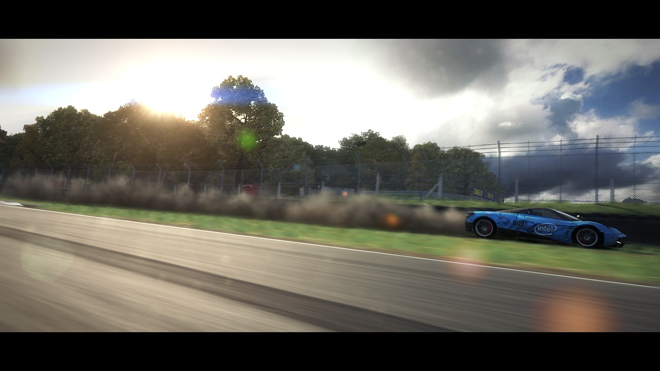
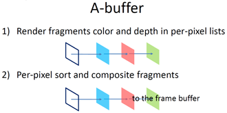
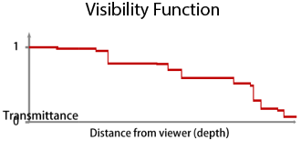
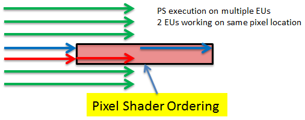
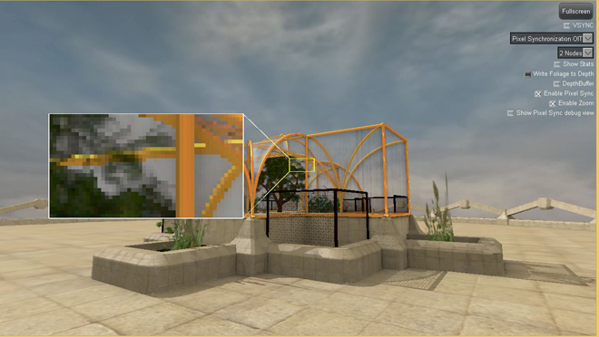

# AOIT-Update

This is an update to the original sample from 2014, the update has two main changes compared to the previous code along with updating the samples to compile with the most recent versions of the Windows SDK and Microsoft Visual Studio*. 

Original Article:https://software.intel.com/content/www/us/en/develop/articles/oit-approximation-with-pixel-synchronization.html

**Update 1** is the change from using Intel’s Pixel Synchronization extension under DX11 to using Microsoft’s Raster Order Views which were introduced as part of DX12 and also supported using DX11.3. The algorithm is unchanged. The following code was added to correctly detect if we were running on a DX11.3 capable device that supports the ROV feature.

Device Detection​:

    D3D11_FEATURE_DATA_D3D11_OPTIONS2 FeatureData;
    ZeroMemory(&FeatureData, sizeof(FeatureData));
    
    ID3D11Device3*  device;
    if (SUCCEEDED(mpD3dDevice->QueryInterface(__uuidof(ID3D11Device3), (void**)&device)))
    {
	    if (SUCCEEDED(device->CheckFeatureSupport(D3D11_FEATURE_D3D11_OPTIONS2, &FeatureData, sizeof(FeatureData))))
    	{
    		mROVsSupported = (FeatureData.ROVsSupported != 0);
    	}
    }

**Update 2** is the change to support HDR texture data in the Order Independent buffer. The original sample stored R8G8B8A8 color data in UAV structured buffer with depth information stored in a separate 32bit surface, a large number of games store their color data in other formats such as R10G10B10A2 or various floating point formats depending on bandwidth to allow for a much higher dynamic range of color that’s latter adjusted during post processing. This could frequently lead to visual artifacts if the transparent elements in the scene weren’t encoded in a suitable format to match the opaque sections. This sample now includes an example code path that supports HDR textures, the alpha component of any transparent objects is now stored as part of the same surface that stores the depth information, making use of a D24X8 format, this allows a full 32bits of data to be used for the color RGB component. There are multiple ways of storing HDR color data in a single 32bit value, Microsoft provides HLSL code for packing various formats into a single unsigned int value here, for this sample I’ve chosen to encode the data using the RGBE format where the RGB values have a shared common exponent a sample demonstrating programmable blending using this format can also be found here. The functions used for encoding the color values are shown in Figure 2.

    // ToRGBE - takes a float RGB value and converts it to a float RGB value with a shared exponent
    float4 ToRGBE(float4 inColor)
    {
    	float base = max(inColor.r, max(inColor.g, inColor.b));e;
    	float m = frexp(base, e);
    	return float4(saturate(inColor.rgb / exp2(e)), e + 127);
    }
    
    // FromRGBE takes a float RGB value with a shared exponent and converts it to a 
    //	float RGB value
    float4 FromRGBE(float4 inColor)
    {
    	return float4(inColor.rgb*exp2(inColor.a - 127), inColor.a);
    }

## Introduction
Transparency is a fundamental challenge in real-time rendering due to the difficulty of compositing in the right order an arbitrary number of transparent layers. The Order Independent Transparency sample using Intel® Iris™ graphics extension for pixel synchronization shows a real-time solution using the extensions available on 4th Generation Intel® Core™ processors. Codemasters used the algorithm in GRID* 2 and GRID Autosport to improve rendering of foliage and semi-transparent track side objects.

Figure 1:

This sample uses a new algorithm that builds on the work originally detailed in the adaptive-transparency article by Marco Salvi, Jefferson Montgomery, and Aaron Lefohn https://software.intel.com/content/www/us/en/develop/articles/adaptive-transparency.html. The article detailed how Adaptive Transparency can closely approximate the ground-truth results obtained from A-buffer compositing but is 5x to 40x faster. Instead of storing all color and depth data in per-pixel lists and then sorting and compositing them, we re-factored the alpha-blending equation to avoid recursion and sorting and produce a “visibility function” (VF).

Figure 2:

Figure 3:

The per-pixel lists are traversed once, and the pixel data is added to an array of data nodes. The number of nodes used to store visibility information corresponds to the number of steps in the visibility function. Once the number of linked pixels traversed for a given screen location exceeds the node size, the algorithm calculates which existing pixel fragments can be merged to create the smallest variation in the visibility function while maintaining the fixed data set size. The final stage is to evaluate the visibility function vis() and composite fragments using the formula final_color=  	TODO, add image for sum -- \sum_{i=1}^{10} t_i.

The new algorithm makes two main changes over this approach; the first is the use of the Intel® Iris™ graphics pixel synchronization extension. Pixel synchronization provides ordered Read/Modify/Write (RMW) for a given pixel. If two pixels in flight are being rendered to the same X,Y screen location, there would be a potential race condition on accessing the relevant data. The pixel shader extension added to the shader acts as a barrier in the pixel shader and only one shader is allowed to continue. Which shader is chosen depends on the order the primitives are submitted to the front end. The remaining shader(s) resume once the first shader has completed in the order they themselves were submitted. As shown in Figure 4.

Figure 4:

Using this we are able to merge pixels as they are rendered rather than in the resolve phase. Merging in the insertion phase removes the requirement to store the per-pixel list, meaning the algorithm now has a fixed memory size. It also removes any potential artifacts normally seen with A-Buffer and Adaptive Transparency algorithms when information is lost when the linked lists storage overflows. In addition, this also improves performance even more by further reducing bandwidth requirements.

The second major change was to the original algorithm used to merge the incoming pixels into the fixed set of nodes. Instead of using the adaptive routine to create the visibility function, we approximate the results by sorting and then merging the furthest pixels. This worked very well when similar color pixels are merged, which is the case when rendering lots of foliage. Different insertion routines can easily be used based on the user’s requirements.

The sample consists of a simple scene designed to showcase the difficulties in rendering complex geometry where transparency plays a major role in correctly rendering the materials, as shown in Figure 5.

Figure 5:

The user can select between alternatives transparency rendering techniques including:

* Alpha Blending (Figure 6), where solid geometry is rendered first followed by transparent objects sorted from the inner objects outwards.
* Alpha Blending with Alpha to Coverage (Figure 7), which requires MSAA and allows the use of depth buffering on simple transparent objects such as foliage.
* The original Adaptive Transparency routine detailed in the linked article implemented using DX11.
* The OIT algorithm using Intel® Iris™ graphics pixel synchronization extension 

To run the final option you must have hardware that supports the Intel® Iris™ graphics pixel synchronization extension. The visual differences can be seen below.

Figure 6.Alpha Blending, Figure 7. Alpha to Coverage, and Figure 8. Pixel Shader Ordering

The sample makes no attempt to hide artifacts in the original alpha-blending solution, which in a real game could be partly solved by further subdividing the models and sorting relative to the camera. The intent is to simply show the types of artifacts OIT solves without the need to presort the semi-transparent geometry before submission to graphics API for rendering. There is a check box that allows the alpha-blended foliage to read/write to the depth buffer showing the types of halo patterns that this would normally cause if semi-transparent geometry updated the depth buffer. This debug option is included to better show the amount of pixels passing the alpha discard test in the foliage shaders.

The sample performs the following steps when running the pixel synchronization OIT algorithm. First, all solid geometry is rendered to the scene. Second, we render any material that requires transparency; any transparent objects in this second stage update both a ClearMaskUAV and an AOIT surface containing multiple nodes of color and depth information per-pixel. Finally, a full-screen resolve pass merges the transparent pixels into the back buffer where the ClearMaskUAV has been set.

For debugging, the sample allows you to view the depth buffer and a representation of the ClearMaskUAV. As part of the 2014 update, the ability to zoom into the image and see the per-pixel changes has been added and is shown in Figure 9.

Figure 9: Image Zoom enabled

It is now also possible to run the Pixel Synchronization OIT routine while disabling the actual pixel synchronization (using the “Enable Pixel Sync” check box). This allows the user to clearly see the artifacts that would normally be generated by the race conditions at a per-pixel level if the synchronization primitive wasn’t available. The Intel-approximated OIT algorithm offers different quality levels where the data is compressed into 2, 4, or 8 nodes. More nodes can more accurately approximate the visibility function, but require additional memory and bandwidth. GRID 2 used the 2-node version as the tradeoff between performance and visual quality was very favorable with only a minor visual difference and a noticeable performance gain.

The main code for the algorithm can be found in the pixel shader function WriteNewPixelToAoit in AOIT.hlsl and the AOITSPResolvePS function in AOIT_resolve.hlsl. The most expensive routine is generally WriteNewPixelToAoit in the insertion phase. By ensuring any pixel shader calling this routine uses earlydepthstencil testing to reject hidden pixels, significant performance gains can be made. The more accurate and comprehensive the depth buffer at this point the more transparent geometry can be occluded leading to an optimization in GRID 2 where even the trees were rendered to the depth buffer if the foliage was close to 100% opaque to reduce unnecessary overdraw.

Attachment 	Size
oit-update-2014.zip 	83.7 MB
Product and Performance Information
1

Performance varies by use, configuration and other factors. Learn more at www.Intel.com/PerformanceIndex.
  